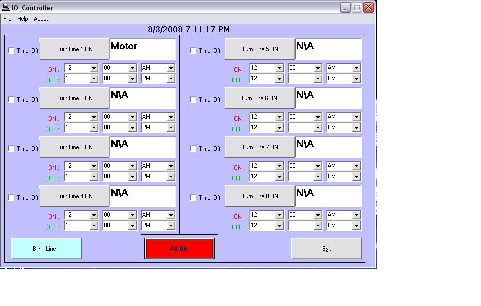



## IO\_Controller

### Description

Conrolls lights, motors, or anything electrical using your printer port and a relay or transistor. Please have some electrical knowledge before you try to use this serial port. Shock hazard and could destroy your computer if you dont have some electrical knowledge.
 
### More Info
 
Some electronics and visual basic.

If you use this code, do not add any voltage to the serial port because you could burn up your computer. It is only used to turn on a transistor or relay since you do get 4.5 volts out, but only need 0.6 to turn on a 2N3055 transistor.

             |
---                |---
**Submitted On**   |2008-08-03 19:12:24
**By**             |[data2delete](https://github.com/Planet-Source-Code/PSCIndex/blob/master/ByAuthor/data2delete.md)
**Level**          |Advanced
**User Rating**    |4.8 (19 globes from 4 users)
**Compatibility**  |VB 5\.0, VB 6\.0
**Category**       |[Complete Applications](https://github.com/Planet-Source-Code/PSCIndex/blob/master/ByCategory/complete-applications__1-27.md)
**World**          |[Visual Basic](https://github.com/Planet-Source-Code/PSCIndex/blob/master/ByWorld/visual-basic.md)
**Archive File**   |[IO\_Control212260832008\.zip](https://github.com/Planet-Source-Code/data2delete-io-controller__1-70922/archive/master.zip)

